# Examples

All examples run with `import plotlive.pyplot as plt`. Replace `plt.show()` with `plt.save_animation('out.gif')` to export instead of opening a window.

---

## Static plots

### Training curves

Line plots with a shaded confidence band. The `fill_between` layer shows ±1σ around the training loss.

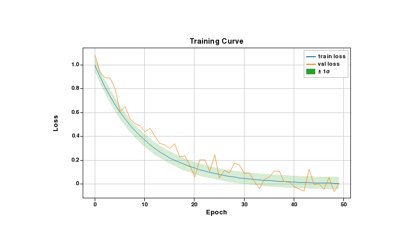

??? example "Code"
    ```python
    import plotlive.pyplot as plt
    import numpy as np

    np.random.seed(0)
    x = np.arange(50)
    plt.plot(x, np.exp(-x/10), label='train loss')
    plt.plot(x, np.exp(-x/12) + 0.05*np.random.randn(50), label='val loss')
    plt.fill_between(x, np.exp(-x/10)-0.05, np.exp(-x/10)+0.05, alpha=0.2, label='± 1σ')
    plt.xlabel('Epoch'); plt.ylabel('Loss'); plt.title('Training Curve')
    plt.legend(); plt.grid()
    plt.show()
    ```

---

### Confusion matrix

`imshow` with a `Blues` colormap. Scroll to zoom into individual cells, drag to pan.

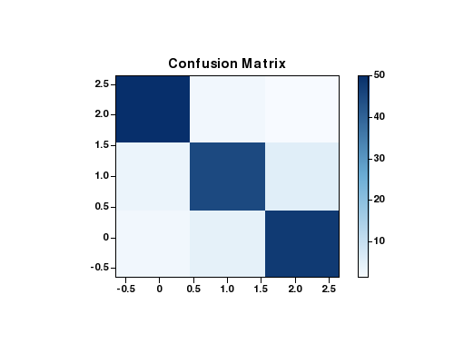

??? example "Code"
    ```python
    import plotlive.pyplot as plt
    import numpy as np

    cm = np.array([[50,2,1],[3,45,5],[2,4,48]])
    fig, ax = plt.subplots(figsize=(5, 4))
    im = ax.imshow(cm, cmap='Blues')
    plt.colorbar(im, ax=ax)
    ax.set_title('Confusion Matrix')
    plt.show()
    ```

---

### Feature importance

Horizontal bar chart with overlaid error bars showing ± standard deviation.

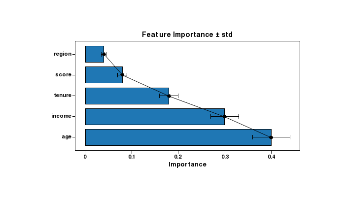

??? example "Code"
    ```python
    import plotlive.pyplot as plt
    import numpy as np

    feats = ['age', 'income', 'tenure', 'score', 'region']
    vals  = [0.40, 0.30, 0.18, 0.08, 0.04]
    errs  = [0.04, 0.03, 0.02, 0.01, 0.005]
    plt.barh(feats, vals)
    plt.errorbar(vals, range(len(feats)), xerr=errs, fmt='none', color='black', capsize=4)
    plt.xlabel('Importance')
    plt.title('Feature Importance ± std')
    plt.show()
    ```

---

### Distribution comparison

Box plot and violin plot side by side on the same data. Useful for comparing summary statistics vs. full distribution shape.

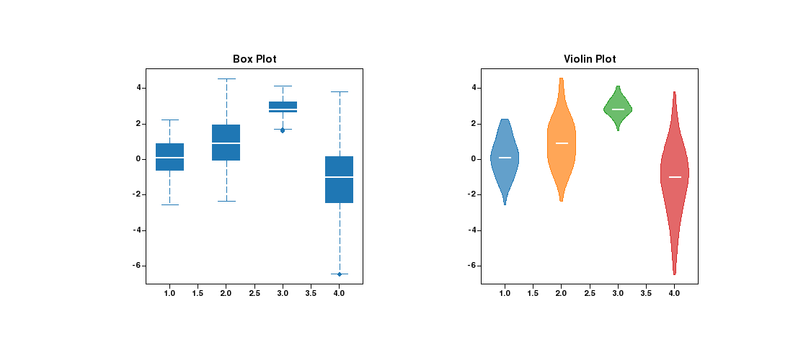

??? example "Code"
    ```python
    import plotlive.pyplot as plt
    import numpy as np

    np.random.seed(0)
    data = [np.random.normal(m, s, 120) for m, s in [(0,1),(1,1.5),(3,0.5),(-1,2)]]
    fig, (ax1, ax2) = plt.subplots(1, 2, figsize=(11, 5))
    ax1.boxplot(data); ax1.set_title('Box Plot')
    ax2.violinplot(data); ax2.set_title('Violin Plot')
    plt.show()
    ```

---

### Correlation heatmap

`coolwarm` colormap with symmetric range `[-1, 1]`. `colorbar` shows the scale.

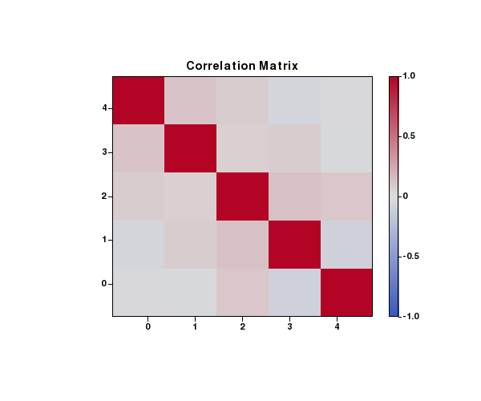

??? example "Code"
    ```python
    import plotlive.pyplot as plt
    import numpy as np

    np.random.seed(0)
    corr = np.corrcoef(np.random.randn(5, 100))
    fig, ax = plt.subplots(figsize=(6, 5))
    im = ax.imshow(corr, cmap='coolwarm', vmin=-1, vmax=1)
    plt.colorbar(im, ax=ax)
    ax.set_title('Correlation Matrix')
    plt.show()
    ```

---

### Stacked area chart

Class proportions over time rendered with `stackplot`. Each layer is a separate class.

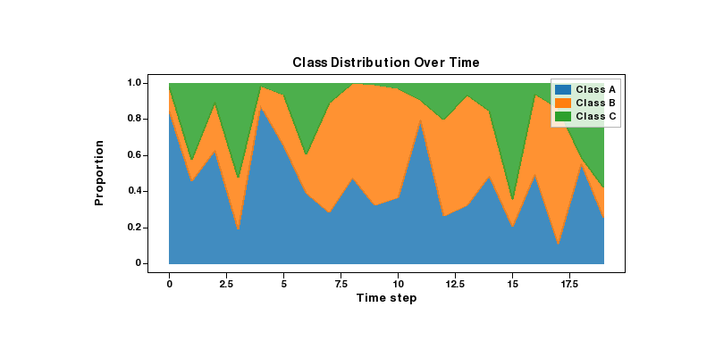

??? example "Code"
    ```python
    import plotlive.pyplot as plt
    import numpy as np

    np.random.seed(1)
    x = np.arange(20)
    a = np.random.dirichlet([3, 2, 1], 20).T
    plt.stackplot(x, a[0], a[1], a[2],
                  labels=['Class A', 'Class B', 'Class C'], alpha=0.85)
    plt.xlabel('Time step'); plt.ylabel('Proportion')
    plt.title('Class Distribution Over Time')
    plt.legend()
    plt.show()
    ```

---

### Pie chart

Sentiment class balance rendered as a pie chart.

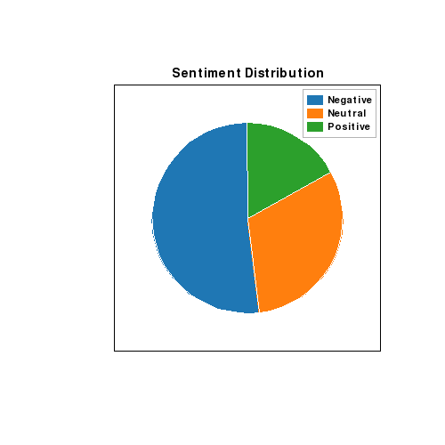

??? example "Code"
    ```python
    import plotlive.pyplot as plt

    plt.pie([52, 31, 17], labels=['Negative', 'Neutral', 'Positive'], startangle=90)
    plt.title('Sentiment Distribution')
    plt.legend()
    plt.show()
    ```

---

## Animated examples

Press `Space` to play, `←` / `→` to step one frame at a time, `S` to save the current frame.

---

### Gradient descent

Point sliding down a quadratic bowl as the weight update shrinks the gradient each step.

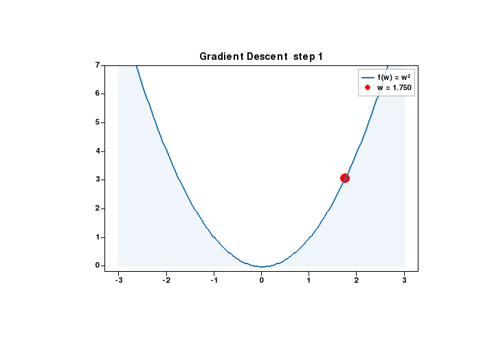

??? example "Code"
    ```python
    import plotlive.pyplot as plt
    import numpy as np

    x = np.linspace(-3, 3, 200)
    w = [2.5]

    def update(frame):
        w[0] -= 0.15 * 2 * w[0]
        plt.cla()
        plt.plot(x, x**2, 'b-', linewidth=2, label='f(w) = w²')
        plt.scatter([w[0]], [w[0]**2], c='red', s=120, zorder=5, label=f'w = {w[0]:.3f}')
        plt.fill_between(x, 0, x**2, alpha=0.07)
        plt.ylim(-0.2, 7); plt.legend()
        plt.title(f'Gradient Descent  step {frame + 1}')

    plt.animate(update, frames=25, interval=200)
    plt.show()
    ```

---

### K-means clustering

Three clusters, centroids (red stars) repositioning each iteration as points are reassigned.

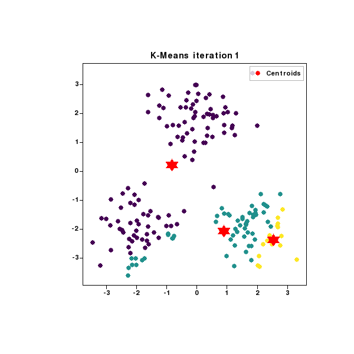

??? example "Code"
    ```python
    import plotlive.pyplot as plt
    import numpy as np

    np.random.seed(7); K = 3
    data = np.vstack([np.random.randn(60,2)*0.7+c for c in [(-2,-2),(2,-2),(0,2)]])
    centroids = data[np.random.choice(len(data), K, replace=False)].copy()

    def update(frame):
        global centroids
        labels = np.array([[np.linalg.norm(p-c) for c in centroids]
                            for p in data]).argmin(1).astype(float)
        centroids = np.array([data[labels==k].mean(0) if (labels==k).any()
                               else centroids[k] for k in range(K)])
        plt.cla()
        plt.scatter(data[:,0], data[:,1], c=labels, cmap='viridis', s=40, alpha=0.7)
        plt.scatter(centroids[:,0], centroids[:,1], c='red', s=220,
                    marker='*', zorder=5, label='Centroids')
        plt.legend(); plt.title(f'K-Means  iteration {frame+1}')

    plt.animate(update, frames=12, interval=500)
    plt.show()
    ```

---

### Softmax classifier

Three-class softmax trained with gradient descent. Decision boundaries rotate and converge as accuracy climbs.


??? example "Code"
    ```python
    import plotlive.pyplot as plt
    import numpy as np

    np.random.seed(0); K = 3
    centers = [(-2, -1), (2, -1), (0, 2.5)]
    X = np.vstack([np.random.randn(50, 2) * 0.8 + c for c in centers])
    y = np.repeat(np.arange(K), 50)
    W = np.zeros((2, K)); b = np.zeros(K)
    MARKERS   = ['+', 'o', '^']
    COLORS    = ['#e74c3c', '#3498db', '#2ecc71']
    BD_COLORS = ['#8e44ad', '#e67e22', '#2c3e50']
    x_edge    = np.array([-5.5, 5.5])

    def softmax(z):
        e = np.exp(z - z.max(axis=1, keepdims=True))
        return e / e.sum(axis=1, keepdims=True)

    def plot_boundary(i, j, color):
        dw = W[:, i] - W[:, j]; db = b[i] - b[j]
        if abs(dw[1]) < 1e-9: return
        plt.plot(x_edge, -(dw[0]*x_edge + db)/dw[1],
                 color=color, linewidth=2, label=f'Boundary {i} vs {j}')

    def update(frame):
        global W, b
        for _ in range(5):
            p = softmax(X @ W + b); oh = np.eye(K)[y]
            W -= 0.1 * (X.T @ (p - oh)) / len(X)
            b -= 0.1 * (p - oh).mean(axis=0)
        plt.cla()
        for k in range(K):
            m = y == k
            plt.scatter(X[m,0], X[m,1], c=COLORS[k], marker=MARKERS[k], s=80, label=f'Class {k}')
        for (i, j), col in zip([(0,1),(0,2),(1,2)], BD_COLORS):
            plot_boundary(i, j, col)
        acc = (np.argmax(X @ W + b, axis=1) == y).mean()
        plt.xlim(-5, 5); plt.ylim(-4, 5); plt.legend()
        plt.title(f'Softmax classifier  epoch {frame * 5}  acc {acc:.0%}')

    plt.animate(update, frames=60, interval=100)
    plt.show()
    ```

---

### ReLU network hidden units

1-hidden-layer ReLU network on the two-moon dataset. Each subplot is one hidden unit: shaded region = where it fires, line = its decision boundary, `w=` = its output weight. Double-click any panel to focus.

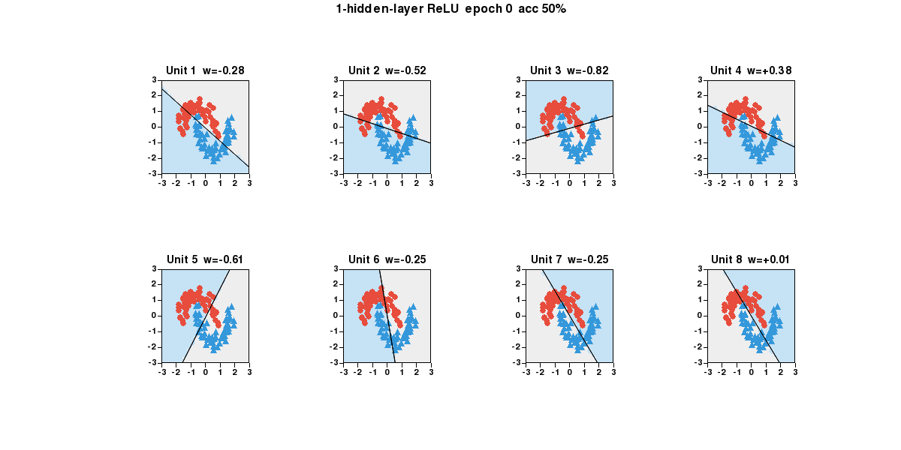

??? example "Code"
    ```python
    import plotlive.pyplot as plt
    import numpy as np

    np.random.seed(0); n_h = 8
    theta = np.linspace(0, np.pi, 60)
    X0 = np.c_[np.cos(theta),   np.sin(theta)     ] + np.random.randn(60,2)*0.15
    X1 = np.c_[1-np.cos(theta), 0.5-np.sin(theta) ] + np.random.randn(60,2)*0.15
    X  = np.vstack([X0, X1]); X = (X - X.mean(0)) / X.std(0)
    y  = np.repeat([0, 1], 60)
    W1 = np.random.randn(2, n_h) * np.sqrt(2/2); b1 = np.zeros(n_h)
    W2 = np.random.randn(n_h, 1) * np.sqrt(2/n_h); b2 = np.zeros(1)
    g = 28; gx, gy = np.linspace(-3,3,g), np.linspace(-3,3,g)
    xx, yy = np.meshgrid(gx, gy); grid = np.c_[xx.ravel(), yy.ravel()]
    x_edge = np.array([-3.5, 3.5])
    COLORS = ['#e74c3c', '#3498db']; MARKERS = ['o', '^']

    def relu(z): return np.maximum(0, z)
    def sigmoid(z): return 1 / (1 + np.exp(-np.clip(z, -50, 50)))
    def forward(Xb):
        z1 = Xb @ W1 + b1
        return sigmoid(relu(z1) @ W2 + b2).ravel(), z1

    fig, axs = plt.subplots(2, 4, figsize=(14, 7))

    def update(frame):
        global W1, b1, W2, b2
        for _ in range(10):
            p, z1 = forward(X); a1 = relu(z1); N = len(X)
            dz2 = (p - y).reshape(-1, 1) / N
            W2 -= 0.05 * a1.T @ dz2; b2 -= 0.05 * dz2.sum(0)
            dz1 = (dz2 @ W2.T) * (z1 > 0)
            W1 -= 0.05 * X.T @ dz1; b1 -= 0.05 * dz1.sum(0)
        p_tr, _ = forward(X); acc = ((p_tr > 0.5).astype(int) == y).mean()
        _, z1_g = forward(grid)
        for i, ax in enumerate(axs.flat):
            ax.cla()
            active = z1_g[:, i] > 0
            ax.scatter(grid[~active, 0], grid[~active, 1], c='#eeeeee', s=40)
            ax.scatter(grid[ active, 0], grid[ active, 1], c='#c6e2f5', s=40)
            w, b = W1[:, i], b1[i]
            if abs(w[1]) > 1e-9:
                ax.plot(x_edge, -(w[0]*x_edge + b)/w[1], 'k-', linewidth=1.5)
            for k in range(2):
                m = y == k
                ax.scatter(X[m,0], X[m,1], c=COLORS[k], marker=MARKERS[k],
                           s=45, edgecolors='k', linewidths=0.5)
            ax.set_xlim(-3, 3); ax.set_ylim(-3, 3)
            ax.set_title(f'Unit {i+1}  w={W2[i,0]:+.2f}')
        plt.suptitle(f'1-hidden-layer ReLU  epoch {frame*10}  acc {acc:.0%}')

    plt.animate(update, frames=100, interval=100)
    plt.show()
    ```

---

### Training curves (animated)

Loss and accuracy plotted in real time as the training loop runs. Two subplots update each frame.

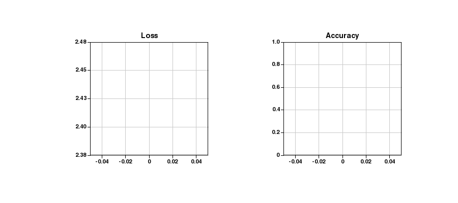

??? example "Code"
    ```python
    import plotlive.pyplot as plt
    import numpy as np

    np.random.seed(1); losses, accs = [], []
    plt.subplots(1, 2, figsize=(10, 4))

    def update(frame):
        t = frame / 80
        losses.append(2.3*np.exp(-3*t) + 0.08 + 0.03*np.random.randn())
        accs.append(min(0.99, 1 - np.exp(-4*t)*0.9 + 0.01*np.random.randn()))
        ax0, ax1 = plt.gcf().axes
        ax0.cla(); ax1.cla()
        ax0.plot(losses, 'b-', linewidth=2); ax0.set_title('Loss'); ax0.grid()
        ax1.plot(accs, 'g-', linewidth=2); ax1.set_title('Accuracy')
        ax1.set_ylim(0, 1); ax1.grid()

    plt.animate(update, frames=80, interval=80)
    plt.show()
    ```

---

### Confidence bands widening

`fill_between` layers at ±1σ and ±2σ. Bands widen each frame to show how uncertainty grows under distribution shift.

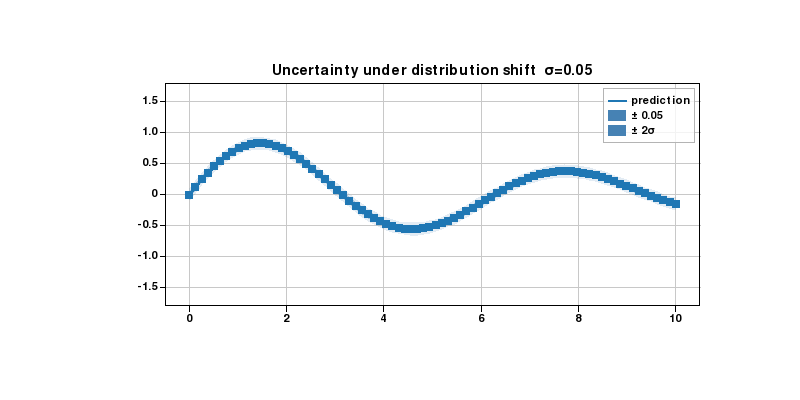

??? example "Code"
    ```python
    import plotlive.pyplot as plt
    import numpy as np

    np.random.seed(0)
    x = np.linspace(0, 10, 80)
    mean = np.sin(x) * np.exp(-x/8)
    noise_levels = np.linspace(0.05, 0.6, 30)

    def update(frame):
        sigma = noise_levels[frame]
        plt.cla()
        plt.plot(x, mean, 'steelblue', linewidth=2, label='prediction')
        plt.fill_between(x, mean - sigma,   mean + sigma,   alpha=0.35,
                         color='steelblue', label=f'± {sigma:.2f}')
        plt.fill_between(x, mean - 2*sigma, mean + 2*sigma, alpha=0.15,
                         color='steelblue', label='± 2σ')
        plt.ylim(-1.8, 1.8); plt.legend(); plt.grid()
        plt.title(f'Uncertainty under distribution shift  σ={sigma:.2f}')

    plt.animate(update, frames=30, interval=150)
    plt.show()
    ```

---

### Learning curve

Error bars shrink as more training data is added. Points appear one by one each frame.

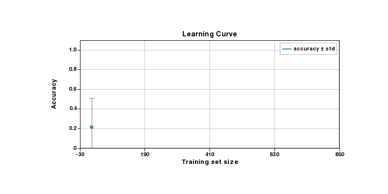

??? example "Code"
    ```python
    import plotlive.pyplot as plt
    import numpy as np

    np.random.seed(0)
    sizes = np.array([10, 25, 50, 100, 200, 400, 800])
    means = 1 - 0.88*np.exp(-sizes/120) + 0.015*np.random.randn(len(sizes))
    stds  = 0.32*np.exp(-sizes/80) + 0.01

    def update(frame):
        n = frame + 1
        plt.cla()
        plt.errorbar(sizes[:n], means[:n], yerr=stds[:n],
                     fmt='o-', capsize=5, color='steelblue', label='accuracy ± std')
        plt.xlim(-30, 850); plt.ylim(0, 1.1)
        plt.xlabel('Training set size'); plt.ylabel('Accuracy')
        plt.title('Learning Curve'); plt.legend(); plt.grid()

    plt.animate(update, frames=len(sizes), interval=600)
    plt.show()
    ```

---

### Prediction distribution per epoch

Box plots reveal how the predicted probability distribution tightens as training progresses.

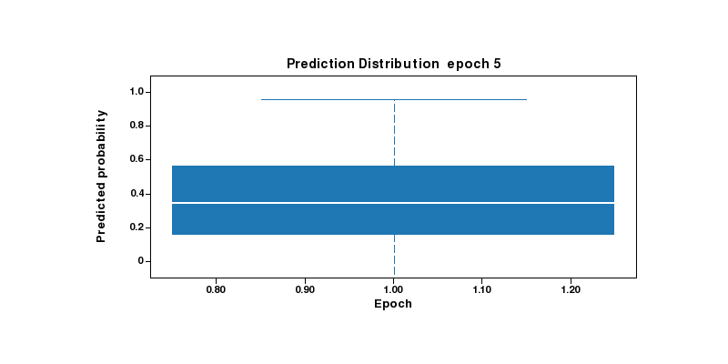

??? example "Code"
    ```python
    import plotlive.pyplot as plt
    import numpy as np

    np.random.seed(1)
    epochs = [5, 10, 20, 40, 80, 160]
    data = [np.random.normal(0.35 + 0.55*(i/len(epochs)),
                              max(0.28 - i*0.04, 0.04), 80)
            for i in range(len(epochs))]

    def update(frame):
        n = frame + 1
        plt.cla()
        plt.boxplot(data[:n], labels=[str(e) for e in epochs[:n]])
        plt.ylim(-0.1, 1.1)
        plt.xlabel('Epoch'); plt.ylabel('Predicted probability')
        plt.title(f'Prediction Distribution  epoch {epochs[frame]}')

    plt.animate(update, frames=len(epochs), interval=700)
    plt.show()
    ```

---

### Activation distribution per training step

Violin plots show how hidden-layer activations concentrate as the network learns.

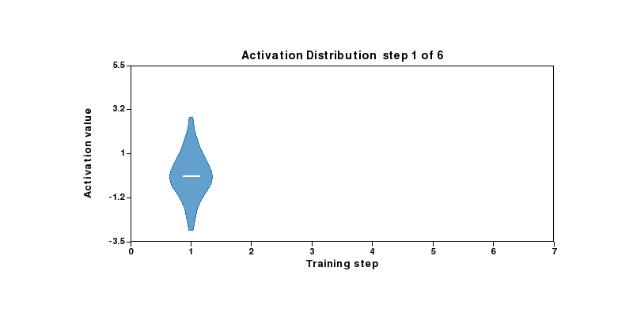

??? example "Code"
    ```python
    import plotlive.pyplot as plt
    import numpy as np

    np.random.seed(2)
    steps = 6
    data = [np.random.normal(i*0.5, max(1.1 - i*0.16, 0.15), 120)
            for i in range(steps)]

    def update(frame):
        n = frame + 1
        plt.cla()
        plt.violinplot(data[:n], positions=list(range(1, n+1)), widths=0.7)
        plt.xlim(0, steps+1); plt.ylim(-3.5, 5.5)
        plt.xlabel('Training step'); plt.ylabel('Activation value')
        plt.title(f'Activation Distribution  step {frame+1} of {steps}')

    plt.animate(update, frames=steps, interval=700)
    plt.show()
    ```

---

### Class rebalancing

Pie chart evolving from an imbalanced dataset toward a uniform class distribution.

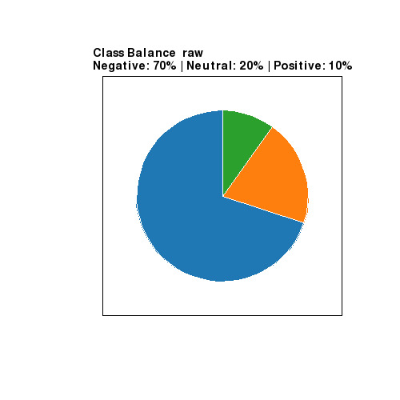

??? example "Code"
    ```python
    import plotlive.pyplot as plt

    labels = ['Negative', 'Neutral', 'Positive']
    stages = [[70,20,10],[60,25,15],[50,30,20],[45,32,23],[40,35,25],[33,34,33]]
    captions = ['raw','oversample pos','oversample more','near balance','balanced','uniform']

    def update(frame):
        plt.cla()
        vals = stages[frame]
        plt.pie(vals, labels=labels, startangle=90)
        pcts = ' | '.join(f'{l}: {v}%' for l, v in zip(labels, vals))
        plt.title(f'Class Balance  {captions[frame]}\n{pcts}')

    plt.animate(update, frames=len(stages), interval=900)
    plt.show()
    ```

---

### Model complexity

`stackplot` grows one component per frame, showing how each feature family contributes to explained variance.

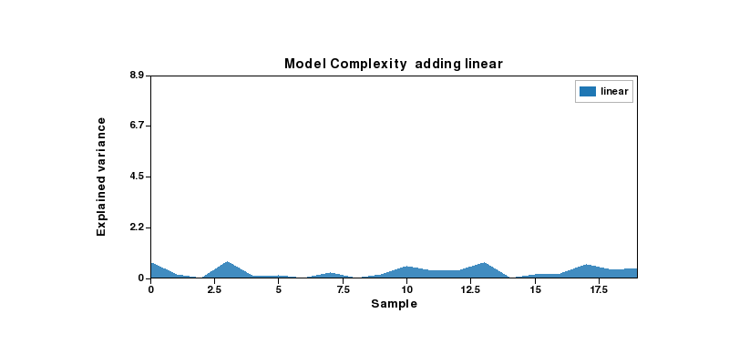

??? example "Code"
    ```python
    import plotlive.pyplot as plt
    import numpy as np

    np.random.seed(3)
    x = np.arange(20)
    feats = ['linear', 'interactions', 'polynomials', 'residuals']
    components = [np.abs(np.random.randn(20)) * (i+1) * 0.4 for i in range(len(feats))]

    def update(frame):
        n = frame + 1
        plt.cla()
        plt.stackplot(x, *components[:n], labels=feats[:n], alpha=0.85)
        plt.xlim(0, 19); plt.ylim(0, sum(c.max() for c in components) * 1.05)
        plt.xlabel('Sample'); plt.ylabel('Explained variance')
        plt.title(f'Model Complexity  adding {feats[frame]}')
        plt.legend()

    plt.animate(update, frames=len(feats), interval=900)
    plt.show()
    ```
