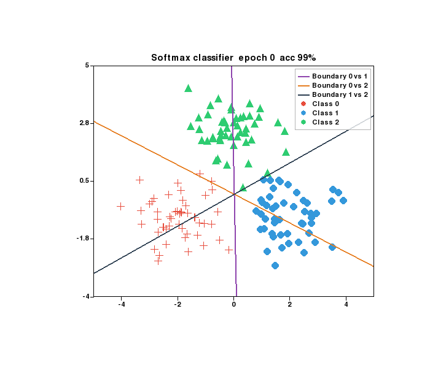

# plotlive

`import plotlive.pyplot as plt` — same API as matplotlib, but `plt.show()` opens a live pygame window you can pan, zoom, and step through frame by frame.



## Install

```bash
pip install plotlive
```

For animation export:

```bash
pip install plotlive[gif]     # GIF  (Pillow)
pip install plotlive[video]   # MP4  (imageio + ffmpeg)
pip install plotlive[export]  # both
```

## Quick start

```python
import plotlive.pyplot as plt
import numpy as np

x = np.arange(50)
plt.plot(x, np.exp(-x/10), label='train loss')
plt.plot(x, np.exp(-x/12) + 0.05*np.random.randn(50), label='val loss')
plt.xlabel('Epoch')
plt.ylabel('Loss')
plt.title('Training Curve')
plt.legend()
plt.grid()
plt.show()
```

## Animation

```python
def update(frame):
    plt.cla()
    plt.plot(x[:frame], y[:frame])
    plt.title(f'Frame {frame}')

plt.animate(update, frames=100, interval=50)
plt.show()
```

Animations start paused. Press `Space` to play, `←` / `→` to step one frame at a time.

## Jupyter

`plt.show()` detects the Jupyter kernel automatically. Static plots render as PNG; animations export as GIF (requires `plotlive[gif]`) or MP4 as fallback.

## Controls

| Key / Action | Result |
|---|---|
| Scroll | Zoom in / out |
| Drag | Pan |
| Double-click | Reset view |
| `Space` | Play / pause animation |
| `←` `→` | Step one frame |
| `R` | Reset zoom and animation |
| `S` | Save current frame as PNG |
| `?` | Show help overlay |
